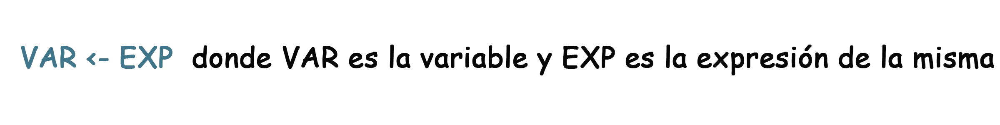
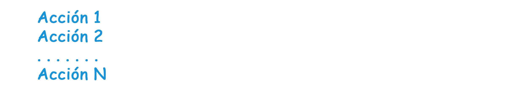
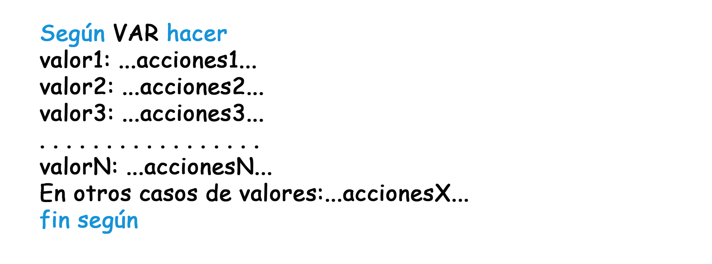

# <ins>EL-ALGORITMO-SEGÚN-SU-ESTRUCTURA</ins>
Descripción de las estructuras del Algoritmo (Pseudocódigo)

# Presentación    

# Start     

# Stop      

# Asignación  

# Entrada de datos     

# Salida de datos      

# ESTRUCTURAS DE CONTROL

Controlan el modo de ejecución del programa. Son de 3 tipos: Secuencial, Selectiva, Repetitiva.

* ## ESTRUCTURA SECUENCIAL

* ## ESTRUCTURA SELECTIVA SIMPLE. Decisión 1 (IF/THEN)

* ## ESTRUCTURA SELECTIVA DOBLE. Decisión 2 (IF/THEN/ELSE)

* ## ESTRUCTURA SELECTIVA MÚLTIPLE. Desición Múltiple (SWITCH)

              
* ## ESTRUCTURA REPETITIVA MIENTRAS. Repetición 1 (WHILE)

* ## ESTRUCTURA REPETITIVA HASTA. Repetición 2 (DO UNTIL)

* ## ESTRUCTURA REPETITIVA DESDE. Repetición 3 (FOR)

